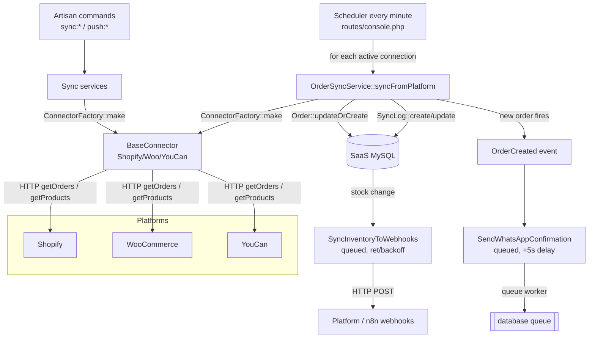

# Developer Onboarding & Operations Guide

**Project:** SaaS Commerce — a multi-tenant commerce platform that syncs products, stock, and
orders between external e-commerce platforms (**Shopify**, **WooCommerce**, **YouCan**) and a
central SaaS core, with WhatsApp order-confirmation automation.

This guide gets you from a fresh checkout to a running app, then explains how the **Background
Synchronization Engine** actually works so you can operate, trigger, and debug it with confidence.

> ℹ️ **The live order-sync path is the every-minute scheduler** (`routes/console.php` →
> `OrderSyncService`). The `SyncPlatformOrders` job and `SyncService::syncOrders()`/`testConnection()`
> were repaired on 2026-07-26 (they previously carried stale signatures); they now delegate to the
> same `OrderSyncService` path and are safe to use. See [Order-Sync Entry Points](#order-sync-entry-points).

---

## Table of Contents

1. [Tech Stack at a Glance](#1-tech-stack-at-a-glance)
2. [Local Environment Setup & Startup](#2-local-environment-setup--startup)
3. [Architecture & Services Deep Dive (Sync Engine)](#3-architecture--services-deep-dive-sync-engine)
4. [Commands & Execution Guide](#4-commands--execution-guide)
5. [Troubleshooting & Best Practices](#5-troubleshooting--best-practices)

---

## 1. Tech Stack at a Glance

| Layer            | Technology                                                             |
| ---------------- | ---------------------------------------------------------------------- |
| Backend          | Laravel **13.7**, PHP **8.3+**                                          |
| Frontend         | **Inertia.js + React 18** (`resources/js/`), Vite 8, Tailwind 4        |
| Auth             | Laravel **Fortify** (2FA enabled) — *not* Breeze                       |
| Legacy UI        | Livewire 3 / Volt / Flux (being retired; login + a few pages remain)   |
| Database         | **MySQL 8** (SQLite in-memory for tests)                               |
| Queue / Cache    | `database` driver (no Redis required for local dev)                    |
| PDF              | mpdf (invoices, receipts, manifests)                                   |
| Testing          | **Pest 4** (`php artisan test`)                                         |
| Local runtime    | Laravel **Herd** (bundled PHP/nginx). Sail is available but not configured. |

**Key domain model:** `User → Stores → PlatformConnections → Orders/Products`. Everything is
multi-tenant by store ownership, and every model uses **ULID** primary keys.

---

## 2. Local Environment Setup & Startup

### 2.1 Prerequisites

| Tool               | Version           | Notes                                                        |
| ------------------ | ----------------- | ------------------------------------------------------------ |
| PHP                | **8.3+**          | With `pdo_mysql`, `mbstring`, `bcmath`, `gd`, `zip`, `intl`. Bundled if you use Herd. |
| Composer           | **2.x**           |                                                              |
| Node.js            | **20+**           | Vite 8 requires a modern Node.                               |
| npm                | **10+**           | Ships with Node 20.                                          |
| MySQL              | **8.x**           | Or MariaDB 10.6+. Create an empty `saas_commerce` schema.    |
| Redis              | *optional*        | Not needed — queue/cache/session default to `database`.      |

> **Laravel Herd (recommended on Windows/macOS):** Herd provides `php`, `composer`, and a local
> web server automatically. If `php` isn't on your PATH in a plain terminal, its binaries live at
> `~/.config/herd/bin/` (e.g. `~/.config/herd/bin/php`).

### 2.2 One-shot setup

A `composer setup` script exists that runs the whole bootstrap in order:

```bash
composer setup
```

This expands to:

```bash
composer install
php -r "file_exists('.env') || copy('.env.example', '.env');"
php artisan key:generate
php artisan migrate --force
npm install
npm run build
```

### 2.3 Manual setup (step by step)

If you prefer to run it yourself (or the one-shot fails partway):

```bash
# 1. PHP dependencies
composer install

# 2. Environment file + app key
cp .env.example .env
php artisan key:generate

# 3. Configure the database in .env (see snippet below), then create the schema:
mysql -u root -e "CREATE DATABASE IF NOT EXISTS saas_commerce CHARACTER SET utf8mb4;"

# 4. Run migrations (add --seed if seeders are present for your branch)
php artisan migrate

# 5. Frontend dependencies + first build
npm install
npm run build
```

**Local-tuned `.env`** — the committed `.env.example` is production-oriented (Railway, `APP_ENV=production`,
`LOG_CHANNEL=stderr`). For local dev, adjust at least:

```dotenv
APP_ENV=local
APP_DEBUG=true
APP_URL=http://localhost:8000

LOG_CHANNEL=stack
LOG_LEVEL=debug

DB_CONNECTION=mysql
DB_HOST=127.0.0.1
DB_PORT=3306
DB_DATABASE=saas_commerce
DB_USERNAME=root
DB_PASSWORD=

QUEUE_CONNECTION=database
CACHE_STORE=database
SESSION_DRIVER=database
MAIL_MAILER=log          # writes "sent" mail to storage/logs/laravel.log

# --- Integrations (only needed to exercise those features) ---
META_APP_ID=
META_APP_SECRET=
META_API_VERSION=v25.0
OPENAI_API_KEY=
EVOLUTION_API_BASE_URL=
EVOLUTION_API_KEY=
EVOLUTION_INSTANCE_NAME=
```

### 2.4 Running the app

The fastest path — the `composer dev` script starts the web server, a queue worker, and Vite
**concurrently** in one terminal:

```bash
composer dev
# ├─ php artisan serve          → http://localhost:8000
# ├─ php artisan queue:listen   → processes queued jobs (auto-reloads on code change)
# └─ npm run dev                → Vite dev server (HMR for React)
```

Or start each process in its own terminal (useful for reading logs separately):

```bash
# Terminal 1 — HTTP
php artisan serve

# Terminal 2 — queue worker (WhatsApp confirmations, outbound inventory webhooks)
php artisan queue:work --tries=3

# Terminal 3 — Vite / React HMR
npm run dev

# Terminal 4 — the SYNC ENGINE (see §3.5). Without this, orders do NOT auto-sync.
php artisan schedule:work
```

> 🔑 **`php artisan schedule:work` is not part of `composer dev`.** The background order sync is a
> scheduled task (`routes/console.php`, every minute). If you don't run the scheduler, nothing pulls
> orders from the platforms automatically — you'd only get data by running a command manually (§4).

### 2.5 Verify it works

```bash
php artisan about          # environment summary
php artisan migrate:status # all migrations "Ran"
php artisan test           # Pest suite (uses in-memory SQLite)
```

---

## 3. Architecture & Services Deep Dive (Sync Engine)

The Sync Engine moves data in **two directions**:

- **Pull (inbound):** fetch products, variants, stock, and orders **from** a platform **into** the
  SaaS database.
- **Push (outbound):** send local product and stock changes **back to** the platform.

> **There is no inbound order webhook.** Shopify/WooCommerce/YouCan orders are **polled** on a
> schedule — the system pulls, it is not pushed to. (The only inbound webhook in the app is the
> WhatsApp/Meta one at `/api/webhooks/whatsapp`, used for customer YES/NO replies, not order intake.)

### 3.1 Where the code lives

```
app/
├─ Connectors/                      ← Platform API clients (the "how to talk to X")
│  ├─ BaseConnector.php             ← abstract: authenticate(), getProducts(), getOrders(),
│  │                                   getProductVariants(), getBaseUrl(), normalizeProduct/Order()
│  ├─ WooCommerceConnector.php
│  ├─ ShopifyConnector.php
│  └─ YouCanConnector.php
│
├─ Factories/
│  └─ ConnectorFactory.php          ← ConnectorFactory::make(PlatformConnection): BaseConnector
│                                      (static; match on $connection->platform)
│
├─ Services/
│  ├─ SyncService.php               ← thin orchestrator: syncProducts()/syncOrders()/testConnection()
│  └─ Sync/                         ← the REAL work happens here
│     ├─ ProductSyncService.php     ← pull products  → syncFromPlatform(Store, string $platform): array
│     ├─ OrderSyncService.php       ← pull orders    → syncFromPlatform(Store, PlatformConnection, ?Carbon $since): SyncLog
│     ├─ StockSyncService.php       ← pull stock     → syncStockFromPlatform(Store, string $platform): array
│     ├─ ProductPushService.php     ← push products/stock → pushProduct(), pushStock()
│     └─ VariantPushService.php     ← push variants
│
├─ Jobs/
│  ├─ SyncPlatformOrders.php        ← queued order pull for one connection → OrderSyncService
│  └─ SyncInventoryToWebhooks.php   ← OUTBOUND: notifies platform webhooks (n8n) on stock change
│
└─ Models/
   ├─ PlatformConnection.php        ← per-store credentials + sync state (is_syncing, last_synced_at…)
   └─ SyncLog.php                   ← one row per sync run (status, counts, error_message)

routes/
└─ console.php                      ← ⭐ the live order-sync SCHEDULER (every minute)
```

### 3.2 The connectors and the factory

Every platform client extends `App\Connectors\BaseConnector` and implements the same contract, so
the rest of the system never branches on platform:

```php
abstract class BaseConnector
{
    public function __construct(protected readonly PlatformConnection $connection) {}

    abstract public function authenticate(): bool;                        // verify credentials
    abstract public function getProducts(int $page = 1, int $perPage = 50): array;
    abstract public function getOrders(int $page = 1, int $perPage = 50, ?Carbon $since = null): array;
    abstract public function getBaseUrl(): string;
    // + getProductVariants(), normalizeProduct(), normalizeOrder()…
}
```

You obtain the right client from the **factory**, which reads the platform off the connection:

```php
use App\Factories\ConnectorFactory;

$connector = ConnectorFactory::make($platformConnection); // returns the correct BaseConnector
$orders    = $connector->getOrders(page: 1, perPage: 50, since: now()->subHour());
```

`PlatformConnection` holds the encrypted credentials (`access_token`, `consumer_key/secret`,
`api_url`, `shop_domain`) **and** the sync bookkeeping the engine relies on:

| Column                 | Meaning                                                        |
| ---------------------- | ------------------------------------------------------------- |
| `status`               | `active` connections are the ones commands/scheduler act on.  |
| `is_syncing`           | Re-entrancy lock — set `true` while a run is in flight.        |
| `last_synced_at`       | Watermark used to fetch only recent orders.                   |
| `last_sync_error`      | Last failure message (surfaced in the UI).                    |
| `synced_orders_count`  | Cached count of orders pulled for this connection.            |

### 3.3 Inbound product sync (pull)

`ProductSyncService::syncFromPlatform(Store $store, string $platform)`:

1. Finds the store's `PlatformConnection` for that platform.
2. Builds the connector and **pages** through `getProducts($page, 50)` until a page comes back empty.
3. `updateOrCreate()`s each product (dedup by `external_id` + platform), syncing variants and
   per-product attributes as it goes.
4. Returns `['created' => int, 'updated' => int, 'failed' => int]`.

`StockSyncService::syncStockFromPlatform()` and `VariantPushService` follow the same
connection → connector → page-loop shape.

### 3.4 Inbound order sync (pull) — the important one

`OrderSyncService::syncFromPlatform(Store $store, PlatformConnection $connection, ?Carbon $since)`
is the heart of the engine:

```
OrderSyncService::syncFromPlatform()
  │
  ├─ SyncLog::create(status: 'running')           ← audit row starts
  ├─ connection->update(is_syncing = true)         ← lock
  │
  ├─ connector = ConnectorFactory::make(connection)
  ├─ do {                                           ← page loop
  │     orders = connector->getOrders(page, 50, since)
  │     foreach (orders as $platformOrder) {
  │         order = saveOrder($platformOrder, connection)   ← Order::updateOrCreate()
  │         createOrderItems(order, items)
  │         if (order->wasRecentlyCreated) {
  │             OrderCreated::dispatch(order)                ← domain event
  │             if phone present:
  │                 SendWhatsAppConfirmation::dispatch(order)->delay(5s)  ← queued
  │         }
  │     }
  │  } while (count(orders) > 0)
  │
  ├─ SyncLog::update(status: 'completed', counts…)
  └─ connection->update(last_synced_at = now, is_syncing = false, synced_orders_count…)

  on Throwable:
  └─ SyncLog::update(status: 'failed', error_message)
     connection->update(last_sync_error, is_syncing = false)
```

Key behaviors:

- **Idempotent:** orders are `updateOrCreate()`d on `(platform_connection_id, platform_order_id)`,
  so re-running never duplicates.
- **Only new orders trigger side effects:** `OrderCreated` + a **delayed (5s), queued**
  `SendWhatsAppConfirmation`. This is why a **queue worker must be running** to send confirmations.
- **Every run is logged** to `sync_logs` (`type = 'orders'`), and the connection's watermark/error
  fields are updated whether it succeeds or fails.

### 3.5 What triggers it automatically — the scheduler

`routes/console.php` registers an **every-minute** scheduled closure — this is the live production
sync loop:

```php
Schedule::call(function () {
    $connections = PlatformConnection::where('is_syncing', false)->get();
    $orderSync   = app(OrderSyncService::class);

    foreach ($connections as $connection) {
        // Pull only recent orders: since the last watermark minus a 5-min safety overlap.
        $since = $connection->last_synced_at
            ? $connection->last_synced_at->subMinutes(5)
            : null;

        try {
            $orderSync->syncFromPlatform($connection->store, $connection, $since);
        } catch (\Throwable $e) {
            Log::error("Scheduled sync failed for store {$connection->store_id}: {$e->getMessage()}");
        }
    }
})->everyMinute();
```

- It **skips connections already syncing** (`is_syncing = false` filter) — the re-entrancy guard.
- The **5-minute overlap** (`last_synced_at->subMinutes(5)`) tolerates clock skew and late-arriving
  orders at the cost of harmless re-processing (safe, because saves are idempotent).
- For the scheduler to fire, a scheduler process must run: `php artisan schedule:work` locally, or a
  cron entry calling `php artisan schedule:run` every minute in production.

### 3.6 Outbound inventory push — `SyncInventoryToWebhooks`

When local stock changes on a sellable warehouse, an `InventoryAdjustment` is created and
`SyncInventoryToWebhooks` is dispatched. It notifies each of the store's platform webhook endpoints
(n8n-style) so the outside world learns the new quantity. It is a resilient queued job:
`tries = 5`, exponential `backoff() = [30, 60, 120, 300, 600]` seconds.

### 3.7 End-to-end data flow



---

## 4. Commands & Execution Guide

### 4.1 Sync (pull) & push commands

All commands accept `--store=<ULID>` and most accept `--platform=<woocommerce|shopify|youcan>`.
Omit them to act on **all** stores / **all** connections.

| Command                 | Direction | What it does                                        | Underlying service |
| ----------------------- | --------- | --------------------------------------------------- | ------------------ |
| `sync:products`         | Pull      | Products for stores/platforms                       | `SyncService::syncProducts` → `ProductSyncService` |
| `sync:all`              | Pull      | Products, **active** connections only, with a progress bar | `ProductSyncService` (direct) |
| `sync:stock`            | Pull      | Stock quantities for active connections             | `StockSyncService` |
| `sync:variants`         | Pull      | Variants of variable products                       | `ProductSyncService::createVariants` |
| `push:products`         | Push      | Local product changes → platform (`--product=<ID>` for one) | `ProductPushService::pushProduct` |
| `push:stock`            | Push      | Local stock totals → platform                       | `ProductPushService::pushStock` |

> **Orders have no Artisan command.** Order pull runs **only** via the scheduler (§3.5). To run it
> manually, use Tinker (§4.3) or trigger `schedule:work`.

### 4.2 Examples

```bash
# Pull products for one store, one platform
php artisan sync:products --store=01J8ZP... --platform=shopify

# Pull products across every active connection (with progress bar + summary table)
php artisan sync:all

# Pull products for all stores/platforms (broad sweep)
php artisan sync:products

# Pull stock for a store
php artisan sync:stock --store=01J8ZP...

# Pull variants of variable products for a store's WooCommerce connection
php artisan sync:variants --store=01J8ZP... --platform=woocommerce

# Push a single local product to whichever platforms it belongs to
php artisan push:products --product=01J8ZQ...

# Push local stock totals to Shopify for one store
php artisan push:stock --store=01J8ZP... --platform=shopify
```

Each command prints a per-connection breakdown and a final `created / updated / failed` (or
`pushed / failed / skipped`) summary, and returns a **non-zero exit code** if anything failed —
handy for CI or cron alerting.

### 4.3 Manually triggering an ORDER sync (no command exists)

<a id="order-sync-entry-points"></a>
There are three equivalent entry points into order sync, all landing on
`OrderSyncService::syncFromPlatform()`:

| Entry point | When it runs |
| ----------- | ------------ |
| Scheduler (`routes/console.php`) | Automatically, every minute, for every non-syncing connection. |
| `SyncPlatformOrders` job | Queued, one connection — `SyncPlatformOrders::dispatch($connection)`. |
| Direct call (Tinker) | On demand, for debugging. |

Use Tinker to invoke the exact same code path:

```bash
php artisan tinker
```

```php
$connection = App\Models\PlatformConnection::where('status', 'active')->first();

// Full backfill (since = null → all pages):
app(App\Services\Sync\OrderSyncService::class)
    ->syncFromPlatform($connection->store, $connection);

// Incremental (last hour only):
app(App\Services\Sync\OrderSyncService::class)
    ->syncFromPlatform($connection->store, $connection, now()->subHour());

// Or via the orchestrator (resolves the connection from store + platform):
app(App\Services\SyncService::class)->syncOrders($connection->store, $connection->platform);

// Or queue it:
App\Jobs\SyncPlatformOrders::dispatch($connection);
```

The direct/orchestrator calls return the `SyncLog` row — inspect `$log->status`, `$log->summary`,
`$log->error_message`.

### 4.4 Running & inspecting the queue

WhatsApp confirmations and outbound inventory webhooks are **queued** (`QUEUE_CONNECTION=database`),
so a worker must be running to process them:

```bash
php artisan queue:work --tries=3          # long-running worker (production style)
php artisan queue:listen --tries=1        # dev: reloads on code changes (used by `composer dev`)

php artisan queue:failed                  # list failed jobs
php artisan queue:retry all               # requeue all failed jobs
php artisan queue:retry <uuid>            # requeue one
php artisan queue:flush                   # delete all failed jobs
```

> Failed jobs need the `failed_jobs` table (present via the standard Laravel migration). Check it
> after any sync run that dispatched confirmations.

### 4.5 Running & debugging the scheduler

```bash
php artisan schedule:work        # runs the scheduler in the foreground (dev)
php artisan schedule:list        # show every scheduled task and its next run time
php artisan schedule:run         # execute due tasks once (what cron calls every minute in prod)
```

**Debugging tips:**

```bash
# Tail the log while a sync runs (all sync services log via Log::info/error)
php artisan pail                 # pretty, filterable live log (laravel/pail is installed)
# or
tail -f storage/logs/laravel.log

# Inspect sync history straight from the DB
php artisan tinker
>>> App\Models\SyncLog::latest()->take(5)->get(['type','status','records_processed','error_message']);
>>> App\Models\PlatformConnection::get(['platform','is_syncing','last_synced_at','last_sync_error']);
```

---

## 5. Troubleshooting & Best Practices

### Wiring Notes

> The order-sync classes below were repaired on **2026-07-26** (they previously had stale
> signatures that would `TypeError`). They are now safe; this table records the current contract.

| Class | Current behavior |
| ----- | ---------------- |
| `SyncService::syncOrders(Store, string $platform)` | Resolves the store's `PlatformConnection` for the platform and delegates to `OrderSyncService::syncFromPlatform($store, $connection)`, returning the `SyncLog`. Throws `RuntimeException` if the store has no such connection. |
| `SyncService::testConnection(PlatformConnection)` | Uses static `ConnectorFactory::make($conn)->authenticate()`. (`ConnectorFactory` exposes only `make(PlatformConnection)` — there is no `create()`.) |
| `SyncService::syncProducts(Store, string $platform)` | Delegates to `ProductSyncService::syncFromPlatform()`. |
| `SyncPlatformOrders` job | `handle(OrderSyncService)` calls `syncFromPlatform($conn->store, $conn)` — the same path as the scheduler. `tries=3`, `timeout=120`. |
| ⚠️ Scheduler/worker **not** in `Procfile` | `Procfile` only starts the web dyno (`heroku-php-apache2`). In any deployed environment you must **separately** run a cron for `schedule:run` **and** a `queue:work` worker, or background sync + WhatsApp confirmations silently never happen. |

> Note: the `EditConnection` / `ConnectionIndex` Livewire components that still call
> `testConnection()` / dispatch `SyncPlatformOrders` are unrouted dead code pending the
> Blade/Livewire retirement; the repaired methods keep them correct in the meantime.

### Common pitfalls

**1. "Nothing is syncing automatically."**
The scheduler isn't running. Start `php artisan schedule:work` (dev) or add the cron entry
(`* * * * * cd /path && php artisan schedule:run >> /dev/null 2>&1`) in prod.

**2. "Orders sync but WhatsApp confirmations never send."**
No queue worker. `SendWhatsAppConfirmation` is queued with a 5s delay — run `php artisan queue:work`.
Also confirm the order has a `customer_phone` (the dispatch is guarded by `filled($order->customer_phone)`).

**3. A connection is "stuck" and never syncs.**
The scheduler skips connections with `is_syncing = true`. If a previous run crashed **hard** (killed
mid-run, OOM) the flag can be left set. The service resets it in both success and catch branches, so
this only happens on an ungraceful kill. Clear it manually:

```php
App\Models\PlatformConnection::where('is_syncing', true)
    ->update(['is_syncing' => false]);
```

**4. Platform API rate limits.**
- **Shopify** (Admin API, ~2 req/s bucket) and **WooCommerce/YouCan** all throttle. Sync services
  page in batches of 50 (`getOrders`/`getProducts`) — avoid running many `--store`/`--platform`
  sweeps in parallel.
- On failure the connector routes through `BaseConnector::handleRequestException()` → throws
  `ConnectorException` → the sync service records `last_sync_error` and marks the `SyncLog` failed.
  Check `sync_logs.error_message` for the platform's response.
- The every-minute cadence + 5-min overlap means a slow platform can have a run still in flight when
  the next tick fires; the `is_syncing` guard prevents overlap, so ticks are skipped rather than
  stacked — this is expected, not a bug.

**5. Token / credential handling.**
- Credentials live on `PlatformConnection` (`access_token`, `consumer_key/secret`, `shop_domain`,
  `api_url`) and are **encrypted at rest** (encrypted casts). Never log them; never commit real
  tokens to `.env`.
- An expired/revoked token surfaces as an `authenticate()` failure or a 401 from the platform →
  `last_sync_error` on the connection. Re-enter credentials via the connection UI.
- WhatsApp/Meta and Evolution API keys are environment-level (`.env`), separate from per-store
  platform tokens.

**6. Duplicate products/orders.**
Should never happen — both use `updateOrCreate()` (orders on `platform_order_id`, products on
`external_id`). If you see dupes, an `external_id`/`platform_order_id` is coming back empty or
inconsistent from the platform. Inspect `platform_data` (raw payload stored on the row).

**7. Per-platform external IDs.**
`Product.external_id` and `ProductVariant.external_id` store **one** platform's ID (last push wins).
For multi-platform lookups, resolve via `SyncLog` (`entity_id` + `platform` + `status = success`),
not the model column.

### Best practices

- **Watch a run end-to-end:** open `php artisan pail` in one pane and trigger a manual sync (§4.3)
  in another — every service logs start/finish/error.
- **Prefer `--store`-scoped commands** in development to keep API usage and log noise low.
- **Treat `sync_logs` as the source of truth** for "did it run and what happened," and the
  `PlatformConnection` sync columns for "what's the current state."
- **Before deploying**, make sure the environment runs three processes, not one: the web server,
  `queue:work`, and the scheduler (`schedule:run` via cron). The `Procfile` currently covers only
  the first.
- **Run the checks** before pushing: `composer lint` (Pint) and `php artisan test` (Pest).

---

*Generated from a direct inspection of the codebase. If a class signature here disagrees with the
code, the code wins — please update this guide (and `.wolf/cerebrum.md`) when you touch the sync
layer.*
